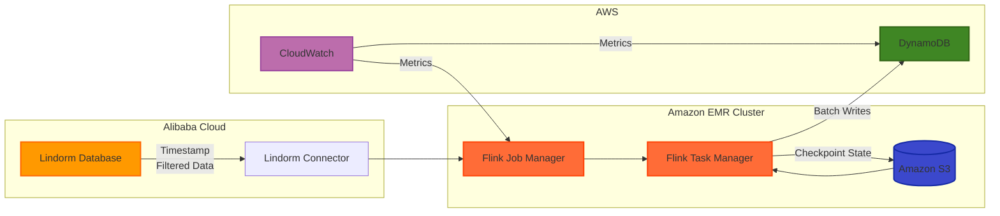

# Lindorm to DynamoDB Import Solution

This project provides a solution for importing data from Alibaba Cloud Lindorm to AWS DynamoDB using Amazon EMR with Apache Flink.

## Requirements

- Import data from Lindorm to AWS DynamoDB
- Data volume: 100GB+
- Record size: 80 bytes per record (approximately 1.25 billion records)
- Filter data by timestamp range during import

## Solution Architecture



### Key Components

- **Source**: Alibaba Cloud Lindorm database
- **Processing**: Amazon EMR cluster running Apache Flink
- **Destination**: AWS DynamoDB
- **Storage**: Amazon S3 for checkpoints and state management
- **Monitoring**: CloudWatch for metrics and alerts

## Quick Start

1. **Set up AWS resources using CloudFormation**:
   ```bash
   aws cloudformation create-stack \
     --stack-name lindorm-to-dynamodb-import \
     --template-body file://cloudformation-template.yaml \
     --parameters ParameterKey=DynamoDBTableName,ParameterValue=my-target-table \
                  ParameterKey=S3BucketName,ParameterValue=my-import-bucket \
                  ParameterKey=DynamoDBWriteCapacity,ParameterValue=7000 \
     --capabilities CAPABILITY_IAM
   ```

2. **Deploy the solution**:
   ```bash
   # Make scripts executable
   chmod +x deploy.sh run.sh monitor.sh
   
   # Deploy to EMR
   ./deploy.sh my-import-bucket jdbc:lindorm://lindorm-host:port/database my_table \
     username password "2023-01-01 00:00:00" "2023-02-01 00:00:00" \
     us-west-2 my-target-table
   ```

3. **Monitor the import progress**:
   ```bash
   ./monitor.sh j-1K48XXXXXXXX my-target-table us-west-2
   ```

## Implementation Approach

### Data Filtering Strategy

We use SQL query filtering in the Lindorm connector (Approach 1) for optimal performance:

```java
// Example configuration for Lindorm source with timestamp filtering
Map<String, String> lindormConfig = new HashMap<>();
lindormConfig.put("connector", "lindorm");
lindormConfig.put("url", "your-lindorm-url");
lindormConfig.put("table-name", "your_table");
lindormConfig.put("username", "username");
lindormConfig.put("password", "password");
// Apply timestamp range filter in the query
lindormConfig.put("scan.query", "SELECT * FROM your_table WHERE timestamp_column >= '2023-01-01 00:00:00' AND timestamp_column < '2023-02-01 00:00:00'");
```

This approach provides:
- Push-down predicates (filtering at source)
- Reduced data transfer
- Lower memory usage
- Reduced serialization/deserialization overhead

### Flink Java Code Explanation

The main implementation is in `LindormToDynamoDBImport.java`, which orchestrates the data transfer process. Here's a detailed explanation of the key components:

#### 1. Command Line Arguments

```java
// Parse command line arguments
final String lindormUrl = args[0];
final String lindormTable = args[1];
final String lindormUsername = args[2];
final String lindormPassword = args[3];
final String startTimestamp = args[4];
final String endTimestamp = args[5];
final String dynamodbRegion = args[6];
final String dynamodbTable = args[7];
final String dynamodbEndpoint = args.length > 8 ? args[8] : null;
```

The application accepts parameters for both source and target configurations, including timestamp range for filtering.

#### 2. Flink Environment Setup

```java
// Set up the streaming execution environment
final StreamExecutionEnvironment env = StreamExecutionEnvironment.getExecutionEnvironment();

// Configure checkpointing for exactly-once processing
env.enableCheckpointing(60000); // Checkpoint every minute
env.getCheckpointConfig().setMinPauseBetweenCheckpoints(30000); // 30 seconds
env.getCheckpointConfig().setCheckpointTimeout(600000); // 10 minutes

// Create the table environment
final StreamTableEnvironment tableEnv = StreamTableEnvironment.create(env);
```

This configures the Flink execution environment with checkpointing for fault tolerance and exactly-once processing guarantees.

#### 3. Lindorm Source Configuration

```java
// Apply timestamp range filter in the query
String query = String.format(
    "SELECT * FROM %s WHERE timestamp_column >= '%s' AND timestamp_column < '%s'",
    lindormTable, startTimestamp, endTimestamp
);

// Register Lindorm table
tableEnv.executeSql(String.format(
    "CREATE TABLE lindorm_source (" +
    "   id STRING, " +
    "   timestamp_column TIMESTAMP(3), " +
    "   data STRING, " +
    "   PRIMARY KEY (id) NOT ENFORCED" +
    ") WITH (" +
    "   'connector' = 'lindorm', " +
    "   'url' = '%s', " +
    "   'table-name' = '%s', " +
    "   'username' = '%s', " +
    "   'password' = '%s', " +
    "   'scan.query' = '%s', " +
    "   'scan.fetch-size' = '1000'" +
    ")",
    lindormUrl, lindormTable, lindormUsername, lindormPassword, query
));
```

This section configures the Lindorm source connector with timestamp-based filtering and registers it as a table in Flink's Table API.

#### 4. DynamoDB Sink Configuration

```java
// Register DynamoDB table
String dynamodbConnectorConfig = String.format(
    "CREATE TABLE dynamodb_sink (" +
    "   id STRING, " +
    "   timestamp_column TIMESTAMP(3), " +
    "   data STRING, " +
    "   PRIMARY KEY (id) NOT ENFORCED" +
    ") WITH (" +
    "   'connector' = 'dynamodb', " +
    "   'table-name' = '%s', " +
    "   'aws.region' = '%s', " +
    "   'aws.batch-size' = '25'",
    dynamodbTable, dynamodbRegion
);

// Add endpoint if provided (useful for testing with DynamoDB Local)
if (dynamodbEndpoint != null && !dynamodbEndpoint.isEmpty()) {
    dynamodbConnectorConfig += String.format(", 'aws.endpoint' = '%s'", dynamodbEndpoint);
}

dynamodbConnectorConfig += ")";
tableEnv.executeSql(dynamodbConnectorConfig);
```

This configures the DynamoDB sink connector with batch writing enabled for optimal performance.

#### 5. Data Transfer Execution

```java
// Execute the import using SQL
tableEnv.executeSql("INSERT INTO dynamodb_sink SELECT * FROM lindorm_source");
```

This simple SQL statement performs the actual data transfer, leveraging Flink's SQL capabilities.

#### 6. Alternative DataStream API Approach

The code also includes a commented-out alternative implementation using the DataStream API:

```java
// Convert table to stream
Table sourceTable = tableEnv.sqlQuery("SELECT * FROM lindorm_source");
DataStream<Row> dataStream = tableEnv.toDataStream(sourceTable);

// Apply additional transformations if needed
dataStream = dataStream
    .rebalance()  // Evenly distribute records across tasks
    .map(new EnrichmentFunction());  // Apply any transformations

// Convert back to table and write to DynamoDB
Table resultTable = tableEnv.fromDataStream(dataStream);
tableEnv.createTemporaryView("processed_data", resultTable);
tableEnv.executeSql("INSERT INTO dynamodb_sink SELECT * FROM processed_data");
```

This approach provides more flexibility for complex transformations, such as adding a random suffix to IDs to avoid hot partitions:

```java
public static class EnrichmentFunction implements MapFunction<Row, Row> {
    @Override
    public Row map(Row value) throws Exception {
        // Apply transformations if needed
        // For example, add a random suffix to the ID to avoid hot partitions
        // String id = value.getFieldAs("id") + "-" + (int)(Math.random() * 100);
        // value.setField("id", id);
        return value;
    }
}
```

#### 7. Error Handling and Fault Tolerance

The application uses Flink's checkpointing mechanism to ensure fault tolerance:

```java
env.enableCheckpointing(60000); // Checkpoint every minute
env.getCheckpointConfig().setMinPauseBetweenCheckpoints(30000); // 30 seconds
env.getCheckpointConfig().setCheckpointTimeout(600000); // 10 minutes
```

This ensures that in case of failures, the job can recover from the last successful checkpoint without data loss or duplication.

### Project Structure

```
lindorm-to-dynamodb-import/
├── src/main/java/com/example/
│   └── LindormToDynamoDBImport.java  # Main Flink application
├── src/main/resources/
│   └── log4j.properties              # Logging configuration
├── cloudformation-template.yaml      # AWS resources template
├── deploy.sh                         # Deployment script
├── emr-config.json                   # EMR cluster configuration
├── monitor.sh                        # Import monitoring script
├── pom.xml                           # Maven dependencies
├── README.md                         # This file
└── run.sh                            # Local execution script
```

### EMR Cluster Configuration

For 100GB+ data volume:

- **Primary Node**: 1 × `m5.2xlarge` (8 vCPU, 32GB RAM)
- **Core Nodes**: 10-15 × `r5.2xlarge` (8 vCPU, 64GB RAM)

#### Flink Configuration Parameters

```
flink.taskmanager.numberOfTaskSlots: 4  # Per core node
flink.parallelism.default: 40-60        # (number of cores × number of nodes × slots per task)
taskmanager.memory.process.size: 52428mb
taskmanager.memory.managed.size: 32768mb
```

### Deployment Options

#### Option 1: Using CloudFormation (Recommended)

1. Deploy the CloudFormation stack:
   ```bash
   aws cloudformation create-stack \
     --stack-name lindorm-to-dynamodb-import \
     --template-body file://cloudformation-template.yaml \
     --parameters ParameterKey=DynamoDBTableName,ParameterValue=my-target-table \
                  ParameterKey=S3BucketName,ParameterValue=my-import-bucket \
                  ParameterKey=DynamoDBWriteCapacity,ParameterValue=7000 \
     --capabilities CAPABILITY_IAM
   ```

2. Wait for stack creation to complete:
   ```bash
   aws cloudformation wait stack-create-complete --stack-name lindorm-to-dynamodb-import
   ```

3. Get the outputs:
   ```bash
   aws cloudformation describe-stacks --stack-name lindorm-to-dynamodb-import --query 'Stacks[0].Outputs'
   ```

#### Option 2: Manual Deployment

1. Create DynamoDB table with appropriate capacity
2. Create S3 bucket for logs and JAR files
3. Set up IAM roles for EMR
4. Configure and deploy EMR cluster using `deploy.sh`

### DynamoDB Capacity Planning

#### WCU Calculation

- Record size: 80 bytes
- WCU capacity: 1 WCU = 1KB write/second
- Records per WCU: ~12.8 records per WCU

| Desired Import Time | Required WCUs |
|---------------------|---------------|
| 1 hour              | ~29,000 WCUs  |
| 4 hours             | ~7,200 WCUs   |
| 8 hours             | ~3,600 WCUs   |
| 24 hours            | ~1,200 WCUs   |

#### WCU Optimization Strategies

1. **On-Demand Capacity**: Recommended for one-time imports
2. **Provisioned Capacity with Auto-Scaling**:
   - Target utilization: 70-80%
   - Configure min/max capacity based on budget
3. **Batch Writing**:
   - Use BatchWriteItem (25 items per batch)
   - Set `dynamodb.sink.batch-size` to 25

## Performance Optimization

### Write Distribution

To avoid hot partitions in DynamoDB:
1. Ensure partition key has high cardinality
2. Add random suffix to keys if needed
3. Use Flink to shuffle records before writing:

```java
// Example optimization
yourDataStream
  .rebalance()  // Evenly distribute records across tasks
  .map(new DynamoDBBatchMapper(25))  // Batch records
  .addSink(new DynamoDBSink(...));
```

### Checkpointing Configuration

For large data volumes:
```
execution.checkpointing.interval: 60000             // 1 minute
execution.checkpointing.min-pause-between-checkpoints: 30000  // 30 seconds
execution.checkpointing.timeout: 600000            // 10 minutes
```

## Implementation Steps

1. Set up EMR cluster with Flink installed
2. Configure appropriate IAM roles for DynamoDB access
3. Develop Flink application with Lindorm source and DynamoDB sink
4. Configure timestamp filtering in Lindorm connector
5. Implement error handling and retry mechanisms
6. Set up monitoring with CloudWatch
7. Execute and monitor the import job

## Monitoring and Validation

### CloudWatch Dashboard

The CloudFormation template creates a CloudWatch dashboard that displays:
- DynamoDB Write Capacity Consumption
- Throttled Requests
- Import progress metrics

### Monitoring Script

The included `monitor.sh` script provides real-time monitoring of:
- EMR cluster status
- Items imported to DynamoDB
- WCU consumption
- Estimated completion time

```bash
./monitor.sh j-1K48XXXXXXXX my-target-table us-west-2
```

## Considerations and Limitations

- Network connectivity between Alibaba Cloud and AWS
- Data transfer costs between clouds
- DynamoDB partition key strategy
- Proper mapping of Lindorm data types to DynamoDB

## Troubleshooting

### Common Issues

1. **DynamoDB Throttling**
   - Symptom: Slow import progress, throttled requests in CloudWatch
   - Solution: Increase WCU or switch to on-demand capacity

2. **EMR Cluster Memory Issues**
   - Symptom: Task failures with OOM errors
   - Solution: Increase taskmanager.memory.process.size or use larger instance types

3. **Lindorm Connection Issues**
   - Symptom: Job fails at startup with connection errors
   - Solution: Verify network connectivity, credentials, and Lindorm endpoint

### Getting Support

For issues with this solution, please open an issue in the GitHub repository or contact your AWS representative.
